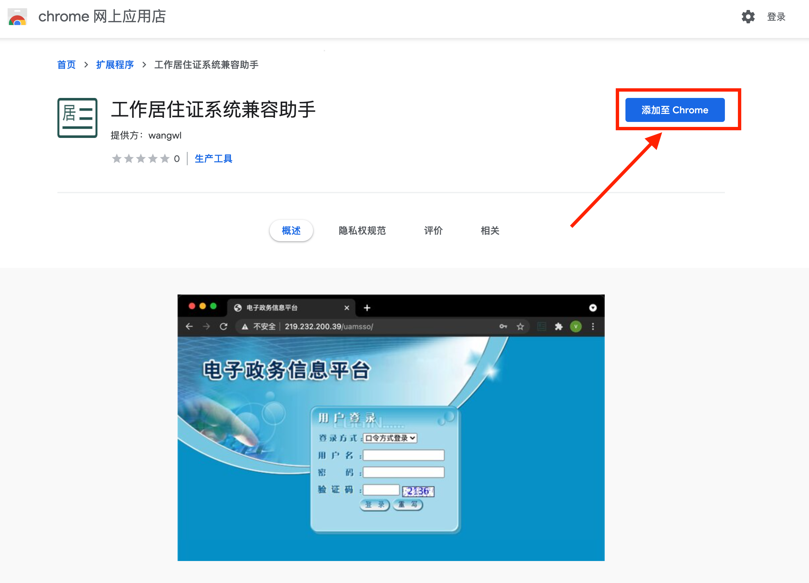
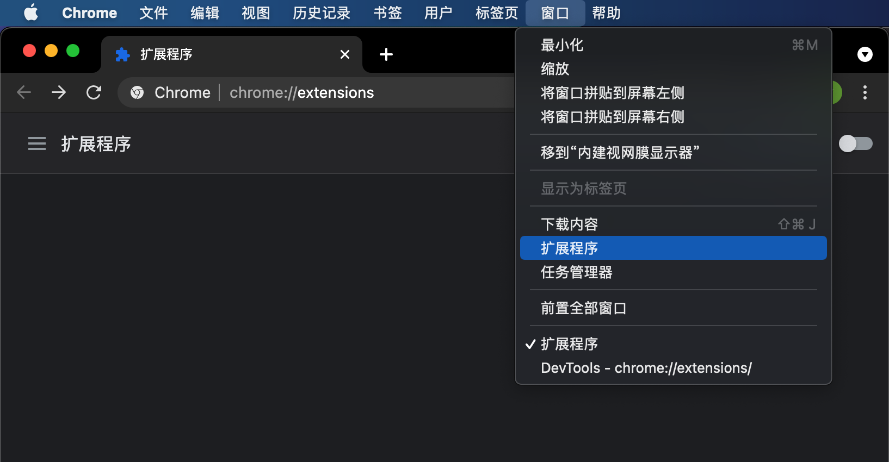
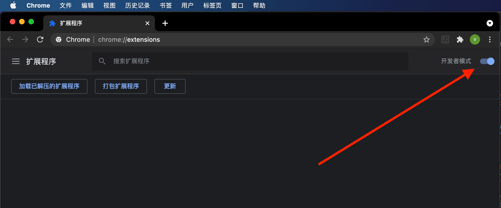
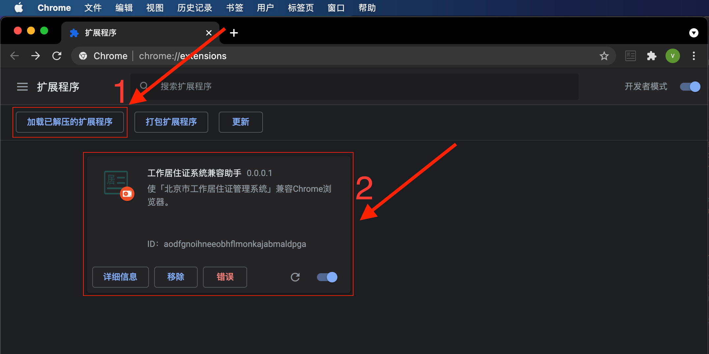

解决Mac用户访问 [「北京市工作居住证管理系统」](http://219.232.200.39/uamsso) 问题。

由于「北京市工作居住证管理系统」只兼容IE6~8，从而Mac用户无法登录。本插件尽量的使该系统兼容Chrome浏览器，使Mac用户可在Chrome浏览器中进行操作。

# 安装方法

## 通过Chrome应用商店安装

链接：[https://chrome.google.com/webstore/detail/工作居住证系统兼容助手/cbaifoibmhipehiccleflhbejjhhfgdd](https://chrome.google.com/webstore/detail/%E5%B7%A5%E4%BD%9C%E5%B1%85%E4%BD%8F%E8%AF%81%E7%B3%BB%E7%BB%9F%E5%85%BC%E5%AE%B9%E5%8A%A9%E6%89%8B/cbaifoibmhipehiccleflhbejjhhfgdd)

打开上面这个链接，点击「添加至Chrome」即可。

安装完成后打开 [北京市工作居住证管理系统](http://219.232.200.39/uamsso) 试下吧。

## 手动安装

通过Chrome应用商店安装，需要用户能够访问谷歌。

如果您的网络环境无法访问谷歌，则可以手动进行安装。

手动安装的缺点是：无法及时获得更新，以及稍微麻烦一丢丢，

### 下载扩展包

下载链接:
1. 从github下载: [https://github.com/relax-code-relax-life/chrome-extension-settle-card/raw/main/output/settleCard.zip](https://github.com/relax-code-relax-life/chrome-extension-settle-card/raw/main/output/settleCard.zip)
2. 从我的个人站下载: [http://wangwl.net/r/chrome_extension_settle_card_zip](http://wangwl.net/r/chrome_extension_settle_card_zip)

随便选一个链接下载即可。第2个链接的zip包会和Chrome应用商店上传的保持一致。第1个链接的zip包可以理解为beta版。

下载完成后，双击解压。

### 安装扩展包

1. 在Chrome中打开扩展程序窗口

2. 打开开发者模式

3. 加载扩展程序

点击「加载已解压的扩展程序」，然后选择刚才解压的文件夹。
   
如下图所示，如果看到有「工作居住证系统兼容助手」，就安装成功了，打开 [北京市工作居住证管理系统](http://219.232.200.39/uamsso) 试下吧。

# 问题反馈

- github: [https://github.com/relax-code-relax-life/chrome-extension-settle-card/issues](https://github.com/relax-code-relax-life/chrome-extension-settle-card/issues)
- 个人站: [http://wangwl.net/static/pages/chrome_settlecard.html](http://wangwl.net/static/pages/chrome_settlecard.html)

在github反馈需要登录github账号，如果未注册github可以在我的个人站匿名评论。看到后会及时回复。

